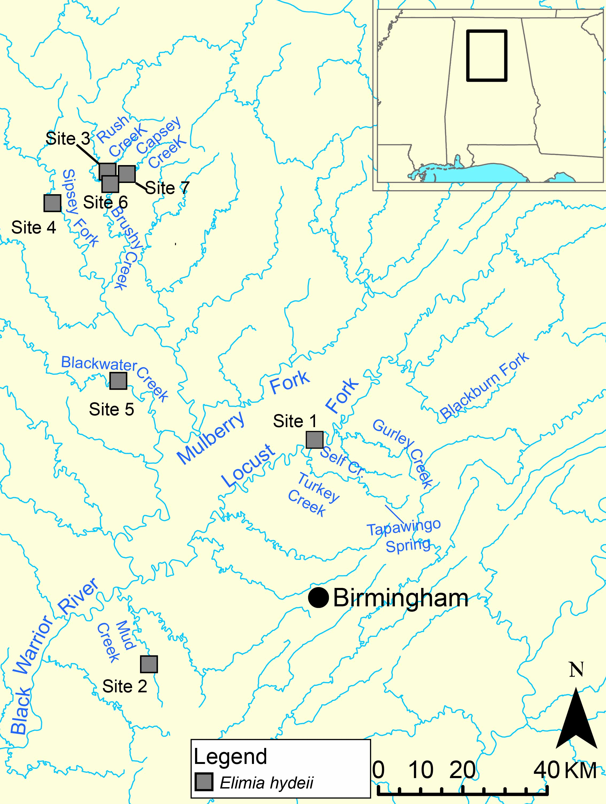

Conservation Genetics Exercise
================
EEOB 4410
25 & 27 March 2026


## Introduction to Conservation Genetics

This exercise will introduce you to common conservation genetics
techniques and analyses that can be done in R. We will be analyzing data
on a freshwater snail species from Alabama. This is real data from a
recently published study. The goal is for you to learn how to analyze
common types of conservation genetics data. The results you will
generate are similar to what is commonly communicated to on-the-ground
managers. You will be answering questions about your analyses that are
similar to questions a conservation geneticist might be asked by a
non-geneticist who is trying to improve conservation outcomes.

We will be performing conservation genetics exercises on the freshwater
snail, Gladiator Elimia (*Elimia melanoides*). The map has the sites
where samples came from. You will want to refer to this map as you
complete the tasks.

<figure>

<figcaption aria-hidden="true">Map of Elimia melanoides collection
sites</figcaption>
</figure>

For this assignment, the Illumina RAD-seq data has already been
generated and assembled in STACKS. The files that you will be using are
assembled single nucleotide polymorphism (SNP) datasets, similar to the
files that you would download from a journal article’s supplementary
data if you wanted to reproduce a paper’s analyses. By starting with
assembled data, we are skipping a required pre-step that is done outside
or R.

### Assignment

- Code should be written in the code editor of Rstudio and the code you
  use should be reported in a Word or Text document. The best option is
  to copy and paste your Rscript at the end of the exercise into a word
  file; this is the best way to report your code for this assignment.
  When you turn in your assignment, it needs to be clear what code you
  ran.

- Several “Tasks” below describe taking screen shots or explaining what
  you did. Place the screenshots and any explanations of what you did in
  a Word Document. Please make clear what Task/Question you are
  answering when writing in the Word Document

- To turn in the assignment, you should turn in a Word Document with the
  results of Tasks (below) and the R code you used. The assignment
  should be turned in via Carmen Canvas under Assignments. The
  assignment is due **April 3, 2026**

- In the text below, some results of R code being run are shown, but
  most are not. That is by design. Part of this assignment will be
  reporting results of code that is run, so the results are not included
  here.

## Logging into The Ohio Supercomputer

Start by starting an interactive R session on the Ohio Supercomputer
[Access Portal](https://class.osc.edu/). Refer back to past exercises if
you need a refresher on how to do this. You will need to copy data from
our class’s repository to your working directory.

- Create a folder for today’s exercise (e.g., “conservation_genetics”).

- Copy the data from
  **/fs/ess/PAS3257/EEOB_4410_OSU/06_Conservation-Genetics** to your new
  folder.

- Set your working directory as inside your conservation genetics
  folder. Remember, this can be as point and click in R studio or with
  the command *setwd*

- Each time you log into the OSC and Rstudio, you will need to set your
  working directory to the appropriate location.

## Preparing to analyze data

There are many different R packages that have been developed for
conservation and populations genetics, some of which will use today.

First, you will need to copy data from
**/fs/ess/PAS3257/EEOB_4410_OSU/06_Conservation-Genetics** if you didn’t
already

Next, let’s load packages that we will use. You can access the
publications to learn more.

- [adgenet](https://doi.org/10.1093/bioinformatics/btr521)

- [hierfstat](https://doi.org/10.1111/j.1471-8286.2004.00828.x)

- [poppr](https://doi.org/10.7717/peerj.281)

- [LEA](https://doi.org/10.1111/2041-210X.12382)

You can also find information about different functions by using
“help(function)”, without the parentheses, and by replacing *function*
with the R command you’re interested in.

Code blocks should be run in Rstudio by you.

``` r
library(adegenet)
library(hierfstat)
library(poppr)
library(LEA)
```

If R did not give you errors, then everything worked; warnings can be
ignored. You may notice that several packages also loaded others, which
are dependencies of each package that are automatically loaded by R.

## Calculate Summary Statistics

Arguably, the most basic conservation genetics information that you can
calculate are statistics like Observed Heterozygosity, Expected
Heterozygosity, Nucleotide Diversity, and Inbreeding Coefficients.

``` r
snail_data<-read.genepop("hydeii_ss_single.snps.gen") ##read in genetic data and assign it to a variable
```

    ## 
    ##  Converting data from a Genepop .gen file to a genind object... 
    ## 
    ## 
    ## File description:  # Stacks v2.66; GenePop v4.1.3; April 23, 2024 
    ## 
    ## ...done.

By default, site labels will be based on the first individual in the
file for each population. That’s confusing.

You can use levels to assign a better name to each site. For this
exercise, we will use site numbers from the above map.

Let’s assign site numbers and cacluate summary statistics

``` r
levels(snail_data$pop) <- c("site_1", "site_2", "site_3", "site_4", "site_5", "site_6", "site_7")
stats<-basic.stats(snail_data) #Calculate basic summary statistics
```

basic.stats is a useful command, but it outputs averages for each value
across all sites. We’re interested in genetic diversity at each site.
basic.stats also doesn’t output standard error values, which are useful
for understanding variation across loci at each site.

Let’s output a nice table with values averaged across each locus for
each site and with standard error for each value

First, we need a function for calculating standard error

``` r
#First we need a function to calculate standard error.
se <- function(x) sd(x, na.rm = TRUE) / sqrt(sum(!is.na(x)))

#Now, let's make the table
pop_summary <- data.frame(
  Mean_Ho    = round(colMeans(stats$Ho, na.rm = TRUE), 4),
  SE_Ho      = round(apply(stats$Ho, 2, se), 4),
  Mean_Hs    = round(colMeans(stats$Hs, na.rm = TRUE), 4),
  SE_Hs      = round(apply(stats$Hs, 2, se), 4),
  Mean_Fis   = round(colMeans(stats$Fis, na.rm = TRUE), 4),
  SE_Fis     = round(apply(stats$Fis, 2, se), 4)
)

#Take a look at the table you created
pop_summary
```

That table is useful, but it’s not in the best format.

Let’s make something a little better for a report that an on-the-ground
manager can more easily read

``` r
#This code is a little complicated, but it uses the "paste0" command to add parentheses to signify SE. 
pop_summary <- data.frame(
  Population = colnames(stats$Ho),
  "Ho (SE)" = paste0(
    round(colMeans(stats$Ho, na.rm = TRUE), 4),
    " (", round(apply(stats$Ho, 2, se), 4), ")"
  ),
  "He (SE)" = paste0(
    round(colMeans(stats$Hs, na.rm = TRUE), 4),
    " (", round(apply(stats$Hs, 2, se), 4), ")"
  ),
  "Fis (SE)" = paste0(
    round(colMeans(stats$Fis, na.rm = TRUE), 4),
    " (", round(apply(stats$Fis, 2, se), 4), ")"
  ),
  check.names = FALSE
)
print(pop_summary, row.names = FALSE)
```

### Task 1: Paste the summary statistics table into your report.

  

### Task 2: Which site has the highest Observed Heterozygosity? Which site has the largest difference between Observed Heterozygosity and Expected Heterozygosity?. Which site has the highest and which site has the lowest F<sub>IS</sub> value?

  

## Analysis of Molecular Variance

One of the first things you probably want to know is whether there is
any genetic structure across the riverscape. This can tell you about how
management units and populations might be defined. You might also be
interested in how much of the overall genetics variation is attributed
to headwaters vs. tributary and each population, but we will focus on
just structure partitioned among site.

We will first use an analysis of molecular variation [(Excoffier et al.
1992)](https://doi.org/10.1093/genetics/131.2.479), also often called an
AMOVA.

First, we need to convert the snail_data variable that we created
earlier from a “geneid” variable to a “genclone” variable. This is
because a single R package does not contain all the functions that we
want to us. There is not a universal standard R variable type for
genetics data.

We will also assign site names to each group of individuals from those
sites. In geneclone objects, these are the “strata”.

``` r
snail_genclone <- as.genclone(snail_data)
strata(snail_genclone)<-(as.data.frame(snail_data$pop))

##Rename strata to something easily interpreted
colnames(strata(snail_genclone))[colnames(strata(snail_genclone)) == "snail_data.pop"] <- "Site"
strata(snail_genclone)

snail_genclone #output summary of the variable
```

### Task 3: How many loci are in the dataset?

  
  
The syntax for an AMOVA command is similar to how you would write code
to perform an ANOVA or Generalized Lineage Model in R.

``` r
snail.site.amova.pop <- poppr.amova(snail_genclone, ~Site, cutoff = 0.5, method = "ade4")
snail.site.amova.pop
```

### Task 4: The amount of variation attributed to different groupings is under “\$componentsofcovariance”. What is the percentage of variation explained between the sites?

  
  
We know how much variation is explained now, but is it statistically
significant? To assess statistical significance, we will use a 1,000
repetition randomization test. Running this code will take a moment. Be
patient.

``` r
snail.site.amova.pop.rtest <- randtest(snail.site.amova.pop, nrepet = 1000)
snail.site.amova.pop.rtest
plot(snail.site.amova.pop.rtest)
```

### Task 5: What is the p-value for the AMOVA?

  

When you plot the randomization test, you’ll see a histogram of values
generated from the random data and a point for the actual data. The less
overlap there is between the histogram (i.e., randomized data) and the
value calculated from real that, the more significant the randomization
test is.

  

### Task 6: Copy the randomization test plots and paste them into your report.

  
  

## Isolation by Distance (IBD)

Often we want to determine if genetic isolation is a simple result of
distance or not. If it is, structure is likely a byproduct of a species’
natural dispersal ability or migration patterns. If differences among
populations is not correlated with distance, other factors may be at
play (e.g., a man-made barrier or geographic feature like a waterfall).

To examine isolation by distance, we first need to know distances among
sample sites. This has already been calculated for you in the files you
copied to your working directory. River distances among sites was traced
in Google Earth.

  
\### Task 7: For a freshwater snail, why does it make more sense to
measure distance along a river path, rather than straigh line distances
between sites?  

We need to calculate a measure of genetic distance between snails at
each sampling. A commonly used measure of genetic distance is
F<sub>ST</sub>. There are multiple ways to calculate F<sub>ST</sub>. We
will use the [Weir and Cockerham
(1984)](https://doi.org/10.2307/2408641) approach.

``` r
WC_snail<-pairwise.WCfst(snail_data,diploid = TRUE) ##Be Patient as it runs.

##Output format is not ideal, let's fix that.
WC_snail[is.na(WC_snail)]<-0
WC_snail<-as.dist(WC_snail) #Convert to a distance matrix with mirrored above-diagnol values removed.
WC_snail ##Outputs the pairwise distance table
```

### Task 8: Copy the F<sub>ST</sub> table into your report.

  
Now, let’s read in the pre-calcuated distance matrix among sites.

``` r
Geo<-read.csv("geo-distances_hydeii.csv", header=FALSE)
Geo<-as.matrix(Geo)
Geo_distances<-as.dist(Geo)
```

Now we’ll perform an Mantel test, which is a statistical test for
assessing whether a correlation exists between two matrices. In this
case the matrices are genetic distance and geographic distance.

``` r
IBD<-mantel.randtest(WC_snail,Geo_distances, nrepet = 1000)
IBD
plot(IBD)
```

### Task 9: What is the p-value for the Mantel test? Is there a significant isolation by distance pattern?

  

### Task 10: Paste the Mantel test randomization test plot into your report. Explain how the plot differs from the AMOVA randomization test.

  
  

## Population Structure with Discriminant Analysis of Principal Components

Testing for population structure with an AMOVA and testing for a
potential of genetic structure with an IBD test tells you a lot of about
a species. However, conservation biologists are often interested in
finer-scale understanding of genetic structure. Being able to visualize
how genetic variation is partitioned across a landscape is usually of
interest.

We are going to use genetic clustering methods to see how individuals
group together. The goal is to visualize finer-scale patterns than what
we can determine from an AMOVA.

First we need to determine the best-fit number of genetic clusters in
the data. The number of clusters is often abbreviated with “K”. The
following command is considered an “interactive” function. \*\*You will
need to answer prompts in the console after running the find.clusters
command

``` r
K <- find.clusters(snail_data, max.n.clust=10) ##There are 7 collection sites, so test up to 10 clusters
##You want to retain all the PCAs, so chose a higher number like 120
##The number of clusters (K) you chose shoud be the value with the lowest BIC value.
```

### Task 11: What was the best-fit number of clusters based on Bayesian Information Criteria (BIC).

  

Now, let’s perform a DAPC. We will want to retain one less PCA than the
number of clusters (K). You will also want to save the same number of
discriminant functions. The command is interactive, as with the
find.clusters command.

``` r
dapc <- dapc(snail_data, K$grp)
```

``` r
#Plot the DAPC with the following plotting command
scatter.dapc(dapc,
            scree.da = TRUE,
            scree.pca = TRUE,
            posi.pca = "topright", 
            posi.da = "top", 
            cstar = 0,
            clab = 0,
            cell =0,
            col=c("#000000","#E69F00","#56B4E9","#009E73","#F0E442","#0072B2","#CC79A7","grey","darkblue","green"), 
            grp=snail_data$pop,
            posi.leg="bottomright",
            leg=TRUE,
)
```

### Task 12: Copy the DAPC plot to your report.

  

### Task 13: Based on the DAPC plot, which site is most genetically similar to Site 1?

  

### Task 14: Compare the clustering pattern in the DAPC with the map of sampling localities (above). What does the DAPC tell you about genetic variation across a landscape?

  
  

## Examining genomic ADMIXTURE for each individual.

A DAPC is a great method, with few assumptions, that allows you to
visualize how sites and individuals cluster together based on genetic
data. However, DAPC does not tell you anything about whether individuals
have a mix of ancestries (i.e., genomic ADMIXTURE).

There are several methods for assessing genomic admixture. We will use
the sparse Non-Negative Matrix Factorization algorithm (sNMF) from the
package LEA because it is a robust and relatively quick method. It’s
also implemented in R.

First, we need to measure the best-fit number of K with LEA. Sometimes
this value differs from what is inferred by DAPC because the underlying
models and assumptions are different. We will also use a different file
format.

``` r
###This command will test K = 1-10, defines the data as diploid, and tells the command to run 5 times per K.
#The command will take a couple minutes
obj.snmf = snmf("hydeii_ss_single.vcf", K = 1:10, ploidy = 2, repetitions = 5, entropy = T, project = "new")  
plot(obj.snmf, col = "blue4", cex = 1.4, pch = 19)
```

### Task 15: Wich K has the lowest cross entropy score? That is the K you should use with the next command.

``` r
# get the cross-entropy of all runs for the best fit K.
ce = cross.entropy(obj.snmf, K = k_replace)  #Replace "k_replace" with the number for best-fit K

# select the run with the lowest cross-entropy for the best-fit K
best = which.min(ce)

##Assign the results to a plotable variable
Q.matrix <- Q(obj.snmf, K = k_replace, run = best) #Replace "k_replace" with the number for best-fit K

site_labels <- pop(snail_data)

# Sort by site first, then by the dominant ancestry cluster within each site
dominant_cluster <- apply(Q.matrix, 1, which.max)
order_idx <- order(site_labels, dominant_cluster)
Q.matrix     <- Q.matrix[order_idx, ]
site_labels <- site_labels[order_idx]


##Plot the admixture plot
barplot(t(Q.matrix), col = c("#D81B60","#1E88E5","#FFC107", "black","yellow", "green", "white", "grey", "red"), border = NA, space = 0,
        xlab = "Individuals", ylab = "Admixture coefficients")

##Add site labels so it's easy to read
sites <- unique(site_labels)
boundaries <- cumsum(table(site_labels))
midpoints  <- c(0, boundaries[-length(boundaries)]) + diff(c(0, boundaries)) / 2
abline(v = boundaries[-length(boundaries)], lty = 2)
axis(1, at = midpoints, labels = sites, las = 2, tick = FALSE, cex.axis = 0.7)
```

  

### Task 16: Copy the admixture plot to your report.

### Task 17: Are there any sites with shared ancestry. What does that tell you about those sites.

  
  
  

## What have we learned about this snail from Alabama?

  

### Task 18: Write at least 1000 words about what the results from your genetic analyses tell you about the biology of Gladiator in Alabama. Make conservatoin recommendations to the Alabama Department of Conservation and Natural Resources and non-profit conservation organization Black Warrior Riverkeeper.

Some things to consider: which sites have the highest genetic diversity
and which sites have the lowest? Are there any patterns associated with
headwaters vs lower river reaches (see map above)? Given the genetic
diversity and number of genetic clusters (or populations) do you think
this species is at risk of extinction? What additional information would
you like to have about the species so you can make informed conservation
recommendations? Are there types of data you would recommend a
conservation agency to generate?

You should make conservation recommendations to the Alabama Department
of Conservation and Natural Resources and the Black Warrior Riverkeeper.
Keep in mind that state agencies and a non-profit like Black Warrior
Riverkeeper might have different perspectives. Justify your
recommendations, even if the recommendation is that the species does not
warrant conservation attention.

  

### Task 19: Don’t forget to copy all of your code to a text file wor past it at the end of your report. This is an important part of the exercise.

## License

This tutorial is licensed under the [Creative Commons Attribution 4.0
International License](https://creativecommons.org/licenses/by/4.0/).
You are free to share and adapt this material, provided you give
appropriate credit to Nathan V. Whelan.
